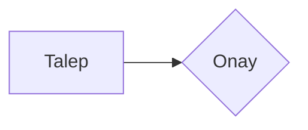
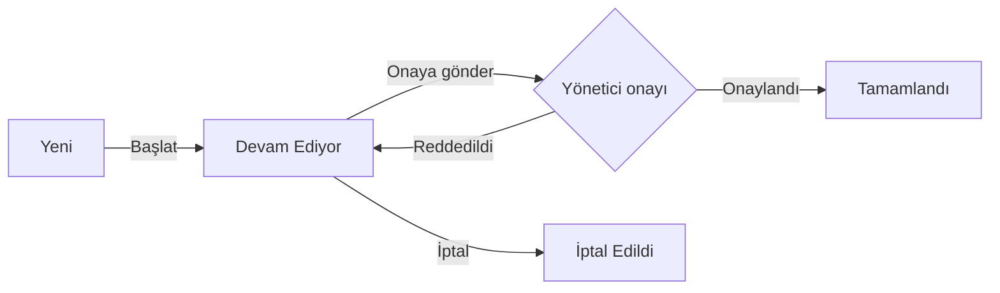
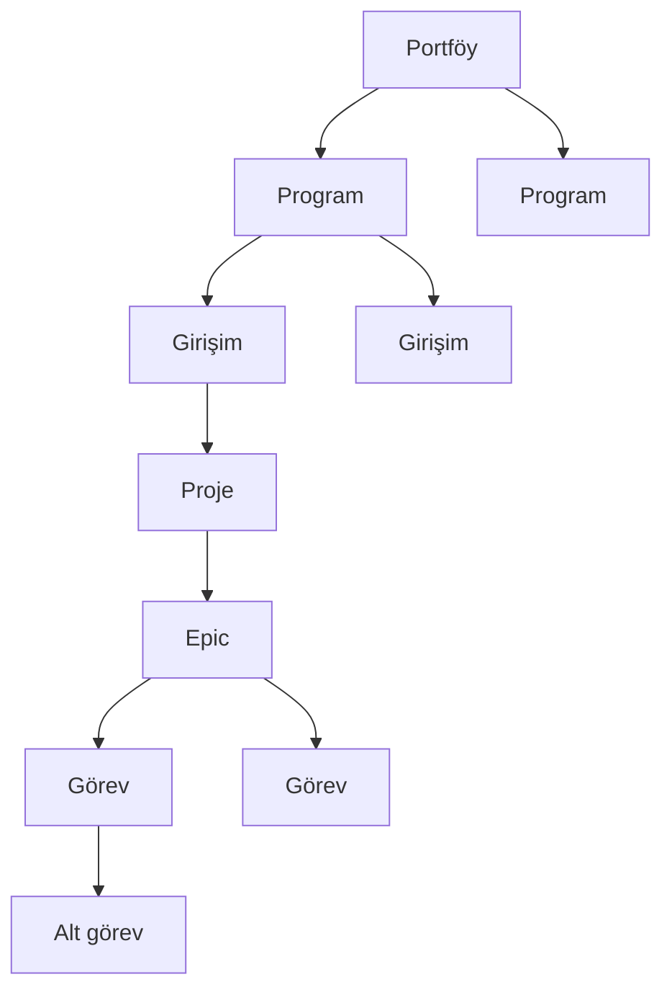
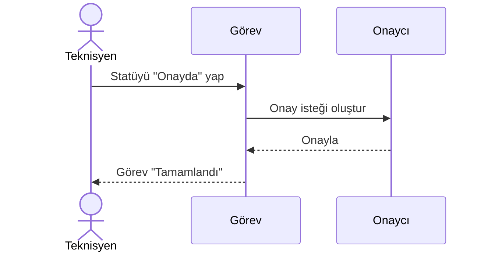

Bu sayfa yalnızca **Mermaid altyapı PR'ının** incelenmesi içindir. Diyagramlar
açık ve koyu temada doğru göründüğü doğrulandıktan sonra, ilk içerik PR'ında
(proje yönetimi çatısı) **silinecektir**.

Yazar tarafında kullanım, düz bir kod bloğudur — bileşen sözdizimi yoktur:

````md

````

## Akış diyagramı

Proje yönetimi dokümantasyonunda en çok bu kullanılacak: statü geçişleri,
onay kapıları, yetki kararları.



## Hiyerarşi

Portföy → program → girişim → proje → epic → görev zinciri.



## Sıra diyagramı

Onay isteğinin uçtan uca yolu.



## Hata durumu

Sözdizimi bozuk bir diyagram sayfayı düşürmez; kaynağı kod olarak gösterir.

```mermaid
flowchart LR
  A[Kapanmamış parantez --> B
```
