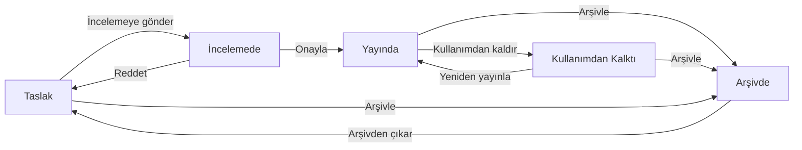

Bilgi Bankası'ndaki her sayfanın bir durumu vardır. Durum, sayfanın kimlere görüneceğini ve aramalarda, önerilerde çıkıp çıkmayacağını belirler. Yeni bir sayfa doğrudan yayına çıkmaz; önce onaya gider.

## Durumlar

Şema ana akışı gösterir; her durumda yapılabilecek işlemlerin tamamı [Durum işlemleri](#durum-işlemleri) tablosundadır.

| Durum | Listede görünen etiket | Ne anlama gelir |
|---|---|---|
| Taslak | `Onaylanmadı` | Üzerinde çalışılan ya da reddedilmiş sayfa. Yayında değildir. |
| İncelemede | `Onay Bekliyor` | Onaya gönderilmiş, onaylayanın kararını bekleyen sayfa. Alan ağacında `Onayda` olarak görünür. |
| Yayında | `Onaylandı` | Onaylanmış, herkesin kullandığı sayfa. Aramada, benzer sayfa önerilerinde ve olay/istek çözüm önerilerinde yalnızca yayındaki sayfalar çıkar. |
| Kullanımdan Kalktı | `Kullanımdan Kalktı` | Artık güncel olmayan ama silinmeyen sayfa. Açılabilir, üstünde uyarı şeridi görünür; öneri olarak sunulmaz. |
| Arşivde | `Arşivde` | Rafa kaldırılmış sayfa. Listelerde, aramada ve önerilerde görünmez; yalnızca bağlantısıyla açılır. |

Filtre panelindeki `Durum` alanında aynı durumlar `Taslak`, `Onay Bekliyor`, `Yayında`, `Kullanımdan kalkan` ve `Arşiv` adlarıyla seçilir. Bkz. [Sayfaları Bulma](/docs/teknisyen/moduller/bilgi-bankasi/tum-sayfalar).

## Onaya gönderme

Yeni bir sayfayı yazıp editördeki `Onaya gönder` düğmesine bastığınızda sayfa **İncelemede** durumuna geçer ve onay yetkisi olan kullanıcıların `Sizin için` sayfasındaki `Onayınızda` listesine düşer. Siz de onu kendi listenizde `Gönderdiklerim` sekmesinde izlersiniz.

Yayındaki bir sayfayı düzenleyip `Güncelle` ile kaydetmek sayfayı yeniden onaya göndermez; değişiklik hemen yayına çıkar ve sürüm geçmişine eklenir.

## Onaylama ve reddetme

Onay yetkiniz varsa, onay bekleyen bir sayfayı açtığınızda üst çubukta iki düğme belirir.

| # | Öğe | Ne işe yarar |
|---|---|---|
| ❶ | `Onayla` | Sayfayı yayına alır. |
| ❷ | `Reddet` | Sayfayı taslağa geri gönderir. Red sebebi yazmak zorunludur. |
| ❸ | Durum etiketi | Sayfanın şu anki durumu. |

`Reddet`e tıklayınca açılan pencerede red sebebini ❶ yazıp yeniden `Reddet` ❷ düğmesine basın. Sebep yazmadan sayfa reddedilemez.

Aynı işlemleri sayfayı açmadan, `Tüm sayfalar` listesindeki kartın `⋯` menüsünden de yapabilirsiniz.

## Durum işlemleri

Sayfanın `Diğer işlemler` menüsündeki `Durum işlemleri` ❶, sayfanın o anki durumunda yapılabilecek işlemleri listeler ❷. Aşağıdaki görüntü yayındaki bir sayfanındır.

| Sayfanın durumu | Yapılabilecekler |
|---|---|
| Taslak | `Onayla` (onay yetkisiyle doğrudan yayına alır), `İncelemeye gönder`, `Arşivle` |
| İncelemede | `Arşivle`. Onaylamak ve reddetmek için üst çubuktaki `Onayla` ve `Reddet` kullanılır. |
| Yayında | `Gözden geçirildi`, `Kullanımdan kaldır`, `Arşivle`, `Onayı geri al` (sayfayı taslağa çeker) |
| Kullanımdan Kalktı | `Yeniden yayınla`, `Arşivle` |
| Arşivde | `Arşivden çıkar` (sayfa taslak olarak geri gelir) |

<Callout type="info" title="ÖNEMLİ">
Bir sayfayı **yayına alan** her işlem (`Onayla`, `Yeniden yayınla`) onay yetkisi ister. Düzenleme yetkisi olan bir kullanıcı arşivdeki sayfayı geri getirebilir, ama sayfa taslak olarak döner ve yeniden onaydan geçmesi gerekir.
</Callout>

## Gözden geçirme ve son geçerlilik

Bir bilginin zamanla eskiyeceğini biliyorsanız editördeki `Ayrıntılar` panelinde iki tarih verebilirsiniz:

- **Gözden geçirme tarihi:** Sayfanın içeriğinin bu tarihte kontrol edilmesi gerekir. Tarih yaklaştığında (7 gün kala) sayfanın sorumlusuna, sorumlu yoksa yazarına hatırlatma gider. Sayfanın başında da bir uyarı şeridi çıkar.
- **Son geçerlilik tarihi:** Bu tarih geçince yayındaki sayfa her gece çalışan bir işle kendiliğinden **Kullanımdan Kalktı** durumuna alınır.

Gözden geçirme tarihi geçmiş bir sayfayı açtığınızda uyarı şeridi ❶ kaç gün geciktiğini yazar. İçeriği kontrol ettikten sonra şeritteki `Gözden geçirildi` ❷ düğmesine basın: gözden geçirme tarihi bugünden 180 gün sonraya ertelenir ve uyarı kalkar. Aynı işlem `Durum işlemleri` menüsünde de bulunur.

Gözden geçirmesi yaklaşan ya da geciken sayfaları listelerde ve kartlarda `Gözden geçirme: 5 gün`, `36 gün gecikti` gibi etiketlerle de görürsünüz. Tüm kurumdaki tabloyu `Sağlık` ekranı verir; bkz. [Yönetim Ekranları](/docs/teknisyen/moduller/bilgi-bankasi/yonetim).

## Kullanımdan kalkan ve arşivdeki sayfalar

Kullanımdan kalkan ya da arşivdeki bir sayfayı açtığınızda en üstte bir uyarı şeridi ❶ görünür:

Kullanımdan kalkan sayfalar son kullanıcı portalında okunmaya devam eder, böylece kullanıcıların elindeki eski bağlantılar kırılmaz. Arşivdeki sayfalar portalda hiç görünmez.
