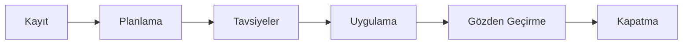

Değişiklik yönetimi, canlı sistemlerde yapılacak bir değişikliğin kontrollü biçimde yapılmasını sağlar: neden gerektiği yazılır, etkisi ve riski değerlendirilir, ilgili kişilere danışılır, uygulama ve geri dönüş planı hazırlanır, iş görevlerle yürütülür ve sonunda gözden geçirilir. Örneğin şube iş istasyonlarının yeni bir işletim sistemine taşınması, bir sunucunun yenilenmesi ya da güvenlik duvarının değiştirilmesi birer değişikliktir.

Değişiklikler modülünde bir değişiklik kaydı açar, planlamasını yapar, danışılacak kişilerden görüş toplar, uygulama görevlerini atar, değişikliği takvimde diğer değişiklikler ve bakım pencereleriyle birlikte izler ve iş bittiğinde kapatırsınız.

Modüle üst menüdeki `Değişiklik` simgesinden girilir.

<Callout type="info" title="ÖNEMLİ">
Bu bölüm yeni değişiklik ekranlarını anlatır. Yeni ekranlar, sistem yöneticinizin `Genel Ayarlar`'da açtığı **Yeni değişiklik sayfalarına yönlendir (beta)** ayarıyla kullanılır. Ayar açıldıktan sonra eski değişiklik adresleri yeni ekranlara yönlenir.
</Callout>

## Temel kavramlar

| Kavram | Anlamı |
|---|---|
| **Değişiklik** | Yapılacak değişikliğin kaydı. Her değişikliğin `CHN` ile başlayan bir numarası vardır, örneğin `CHN7`. |
| **Planlama** | Değişikliğin gerekçesi, etkileri, uygulama planı, başarısızlık durumunda kaçış planı ve geri dönme testi; ayrıca efor, maliyet, beklenen kesinti ve bakım pencereleri. Bkz. [Planlama](/docs/teknisyen/moduller/degisiklikler/planlama). |
| **Tavsiye** | Değişiklik hakkında görüşü alınan kişinin (servis sahibi, uzman, danışman, yönetici) onayı ya da reddi. Kişiler bir danışma kurulundan seçilebilir ya da kurum dışından e-posta adresiyle eklenebilir. Bkz. [Tavsiyeler ve Onaylar](/docs/teknisyen/moduller/degisiklikler/tavsiyeler-ve-onaylar). |
| **Planlanan zaman** | Değişikliğin yapılacağı aralık: `Planlanan Başlangıç` ve `Planlanan Bitiş`. Planlanan zamanı girilen değişiklikler [takvimde](/docs/teknisyen/moduller/degisiklikler/takvim) görünür. |
| **Kesinti** ve **Bakım penceresi** | Kesinti, değişiklik sırasında hizmetin kullanılamayacağı beklenen süredir. Bakım penceresi, değişikliğin yapılmasına izin verilen zaman aralığıdır; bir değişikliğin birden fazla bakım penceresi olabilir. |
| **Uygulama** | Değişikliği hayata geçiren görevler. Görevler ekip üyelerine atanır ve iş günlükleriyle takip edilir. |
| **Gözden geçirme** | Değişiklik uygulandıktan sonra sonuçların değerlendirileceği tarih ve notlar. |
| **Durum ve aşama** | Değişikliğin süreçteki yeri. Her durum bir aşamaya aittir: `Açık` ya da `Beklemede` aşamasındaki değişiklikler sürmektedir, `Kapalı` aşamadakiler tamamlanmıştır. Bkz. [Gözden Geçirme ve Kapatma](/docs/teknisyen/moduller/degisiklikler/gozden-gecirme-ve-kapatma). |

## Ekranın bölümleri

| # | Açıklama |
|---|---|
| ❶ | **Sekmeler** — İlk sekme `Değişiklik` listesidir. Açtığınız her değişiklik buraya `Değişiklik 7` gibi ayrı bir sekme olarak eklenir; birkaç değişiklik arasında listeyi kaybetmeden geçiş yapabilirsiniz. |
| ❷ | **Üst düğmeler** — Liste ile takvim arasında geçiş, `Yeni Değişiklik`, genel arama ve `Grid Görünümü`. Bkz. [Değişiklik Listesi](/docs/teknisyen/moduller/degisiklikler/liste). |
| ❸ | **Değişiklik kartı** — Listedeki her değişiklik bir kart olarak görünür; numara, durum, konu, kişiler ve öncelik kartın üzerindedir. |
| ❹ | **Filtre Görünümleri** — Kayıtlı filtreler; tek tıkla uygulanır. |
| ❺ | **Kontrol Paneli** — Ayrıntılı süzme alanları. Bkz. [Filtreler](/docs/teknisyen/moduller/degisiklikler/filtreler). |

Liste açılışta **kapalı aşamadaki** değişiklikleri göstermez. Kapatılan değişiklikleri görmek için `Kontrol Paneli`nde `Aşama` alanından `Kapalı`yı seçin.

## Bir değişikliğin yolculuğu

Değişiklikler modülü belirli bir sırayı zorunlu tutmaz; aşağıdaki adımlar tipik bir değişikliği gösterir ve her adım detay ekranındaki bir sekmeye karşılık gelir.

1. **Kayıt:** `Yeni Değişiklik` ile değişiklik açılır. Bkz. [Değişiklik Oluşturma](/docs/teknisyen/moduller/degisiklikler/olusturma).
2. **Planlama:** Gerekçe, etkiler, uygulama ve geri dönüş planı yazılır; planlanan zaman, kesinti ve bakım pencereleri girilir.
3. **Tavsiyeler:** Danışılacak kişiler eklenir ve onaya gönderilir; yanıtlar tabloda toplanır.
4. **Uygulama:** Ekip üyelerine görevler atanır, harcanan efor iş günlüğüne yazılır.
5. **Gözden geçirme:** Uygulamadan sonra değerlendirme tarihi ve notları girilir.
6. **Kapatma:** Değişiklik kapatılır ya da reddedilir.

## Diğer modüllerle bağlantı

- **Olaylar, problemler, istekler, sürekli iyileştirme ve projeler:** Değişikliği bu kayıtlara bağlayabilir ya da değişiklikten yeni ilgili kayıt açabilirsiniz. Bkz. [Bağıntılar ve Varlıklar](/docs/teknisyen/moduller/degisiklikler/bagintilar-ve-varliklar).
- **Varlıklar ve hizmetler:** Değişiklikten etkilenen varlıkları ve hizmetleri değişikliğe ekleyerek etkiyi aynı ekrandan izlersiniz.
- **Görevler:** Uygulama görevleri Görevler modülündeki görevlerdir; görevlerin iş günlükleri değişikliğin eforuna yansır.

Son kullanıcılar portalda kendilerine ait değişiklik kayıtlarını görüntüleyebilir ve kendilerine gönderilen danışma isteklerini yanıtlayabilir.
