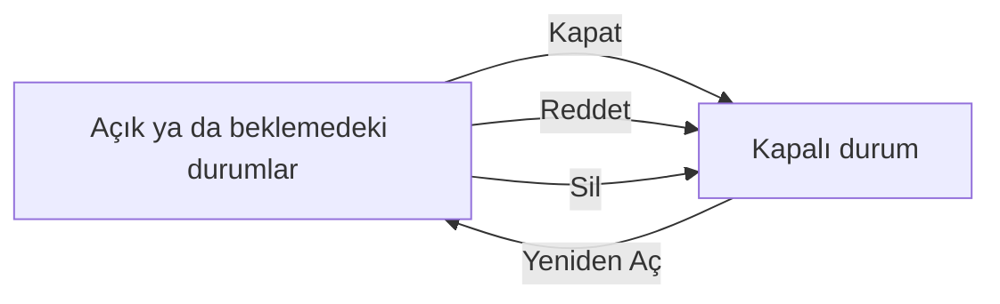

Değişiklik uygulandıktan sonra sonuçları değerlendirilir ve değişiklik kapatılır. Bu sayfa gözden geçirme sekmesini ve bir değişikliğin kapalı aşamaya geçtiği bütün yolları anlatır.

## Gözden geçirme

`Gözden Geçirme - İzleme` sekmesi, değişikliğin uygulandıktan sonra ne zaman ve nasıl değerlendirileceğini tutar. Sekme, sekme çubuğunun sonundaki `…` menüsünde olabilir.

| # | Açıklama |
|---|---|
| ❶ | **Bir Sonraki Gözden Geçirme Tarihi** — Değerlendirmenin yapılacağı tarih. Tarihi seçip yanındaki `Kaydet`e basın. |
| ❷ | **Sil** — Gözden geçirme tarihini, notlarını ve eklerini birlikte siler; onay ister. |
| ❸ | **Gözden Geçirme Notları** — Değerlendirmede bakılacaklar ya da değerlendirmenin sonucu. Kalem simgesiyle düzenleyip kartın altındaki `Kaydet`e basın. |
| ❹ | `Dosyalar` — Gözden geçirmeye ait dosyalar; sağdaki simgeyle yüklenir. |

## Durumlar

Her değişikliğin bir durumu vardır ve her durum bir **aşamaya** aittir. Aşama, değişikliğin listede görünüp görünmeyeceğini ve hangi işlemlerin yapılabileceğini belirler.

| Durum | Ne zaman kullanılır |
|---|---|
| `Açık` | **Açık aşama.** Yeni değişikliğin varsayılan durumu. |
| **Kapatılanlar** | **Kapalı aşama.** Değişiklik kapatıldı, reddedildi ya da silindi. |

Durum listesi yöneticiler tarafından genişletilebilir; kurumunuzda açık, beklemede ve kapalı aşamalarda başka durumlar da görebilirsiniz.

Açık ve beklemedeki durumlar arasında serbestçe geçebilirsiniz; bunun için `Özellikler` panelindeki `Durum` alanını, kartın `Hızlı Güncelleme` simgesini ya da toplu işlemi kullanın. Kapalı bir duruma ise yalnızca **kapatma**, **reddetme** ya da **silme** ile geçilir; kapalı bir değişikliği tekrar açık aşamaya almak için **yeniden açma** kullanılır.

Liste açılışta kapalı aşamadaki değişiklikleri göstermez. Onları görmek için `Kontrol Paneli`nde `Aşama` alanından `Kapalı`yı seçin.

## Değişikliği kapatma

Değişikliğin araç çubuğundaki `Kapat` düğmesi `Kapatma Bilgileri` penceresini açar.

| # | Açıklama |
|---|---|
| ❶ | `Gerekçe` — Değişikliğin neden kapatıldığı; kurumunuzda tanımlı kapatma gerekçelerinden seçilir. İsteğe bağlıdır. |
| ❷ | `Durum` — **Zorunlu.** Değişikliğin alacağı kapalı durum, örneğin `Kapatılanlar`. |
| ❸ | **Kapatma Açıklaması** — **Zorunlu.** Değişikliğin nasıl sonuçlandığının kısa açıklaması. Sağ paneldeki `Kullanıcı / Bilgiler` bölümünde görünür. |

Değişiklik kapatıldığında:

- Henüz yanıt vermemiş danışılan kişilerin durumu **Onay Süresi Doldu** olur. Bkz. [Tavsiyeler ve Onaylar](/docs/teknisyen/moduller/degisiklikler/tavsiyeler-ve-onaylar).
- Değişikliğe kapatma açıklamasını içeren bir sistem notu eklenir.
- Sistem yöneticiniz `Genel Ayarlar`'da **Değişiklik kaydı kapatıldığında ilişkili istek kayıtlarını da kapat** ayarını açtıysa değişikliğe bağlı istekler de kapatılır.

Birden fazla değişikliği birlikte kapatmak için listede seçip toplu işlem çubuğundaki `Kapat`ı kullanın; bkz. [Değişiklik Listesi](/docs/teknisyen/moduller/degisiklikler/liste#toplu-işlemler).

## Reddetme

Değişiklik uygulanmayacaksa `Diğer Eylemler` › `Reddet` ile reddedilir. Açılan `Reddet` penceresi kapatma penceresiyle aynı alanları taşır: `Gerekçe`, zorunlu `Durum` ve zorunlu **Kapatma Açıklaması**; onaylamak için penceredeki `Kapat`a basılır.

Reddetmenin kapatmadan iki farkı vardır:

- Kapatma kuralları uygulanmaz; eksik planlama ya da açık görev olsa da değişiklik reddedilebilir.
- Ayrı bir yetki gerektirir. Bkz. [Yetkiler](/docs/teknisyen/moduller/degisiklikler/yetkiler).

## Kapalı değişiklik

Kapalı bir değişiklikte `Kapat` düğmesinin yerinde `Yeniden Aç` ❶ görünür ve `Özellikler` alanları salt okunur olur. Sağ paneldeki `Kullanıcı / Bilgiler` bölümünde kapatılma tarihi ve kapatma açıklaması ❷ yer alır.

## Yeniden açma

`Yeniden Aç` düğmesi bir pencere açar. Değişikliğin alacağı açık ya da beklemedeki `Durum`u ❶ seçip `Yeniden Aç`a basın.

## Silme

Bir değişikliği silmek için araç çubuğundaki `Diğer Eylemler` › `Sil`i ya da listedeki toplu `Sil`i kullanın. Pencerede bir **Silme Gerekçesi** yazmanız ve kapalı bir `Durum` seçmeniz istenir; ikisi de zorunludur. Silinen değişiklikler listede ve takvimde görünmez; silinen kayıtları görme yetkisi olanlar `Kontrol Paneli`ndeki `Silinmiş mi?` kutusuyla onları listeleyebilir.

## Arşivleme

`Diğer Eylemler` › `Arşivle`, açık bir değişikliği arşive kaldırır. Arşivlenen değişiklikler varsayılan listede görünmez; `Kontrol Paneli`ndeki `Arşivlenmiş mi?` kutusuyla listelenir.

## Kapatma kuralları

Sistem yöneticiniz, bir değişikliğin kapatılabilmesi için bazı koşulları zorunlu tutabilir. Kurallar varsayılan olarak kapalıdır. Açılabilecek kurallar:

| Kural | Kapatmadan önce gereken |
|---|---|
| Alanlar | Açıklama, kategori, iş etkisi, öncelik, teknisyen, teknisyen grubu ya da bölüm dolu olmalı. |
| Planlama | Değişiklik gerekçesi, etki açıklaması, uygulama planı, geri dönüş planı ya da planlanan başlangıç ve bitiş tarihleri girilmiş olmalı. |
| Tavsiye | En az bir danışılan kişi eklenmiş olmalı. |
| Gözden geçirme | Gözden geçirme notu girilmiş olmalı. |
| Görevler | İlişkili görevler kapatılmış ya da görevlere iş günlüğü girilmiş olmalı (iki ayrı kural). |
| İş günlüğü, not | Değişiklikte iş günlüğü ya da not bulunmalı. |
| Varlık ve hizmet | En az bir varlık ya da hizmet eklenmiş olmalı. |
| Kapatma açıklaması | Kapatma açıklaması yazılmalı. |

Eksik bir kural varsa `Kapat` düğmesine bastığınızda pencere açılmaz; ekranın sağ altında eksik kuralları listeleyen bir uyarı çıkar. Formdaki zorunlu alanlar boşsa `Kapat` düğmesi kilitlenir ve üzerine geldiğinizde eksik alanlar listelenir.

Tavsiye kuralı yalnızca danışılan kişi eklenmiş olmasını arar; kişilerin onaylamış olmasını aramaz.
