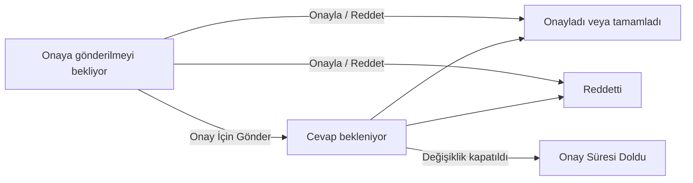

Bir değişiklik uygulanmadan önce servis sahiplerinin, teknik uzmanların, danışmanların ve yöneticilerin görüşü alınır. `Tavsiyeler` sekmesinde danışılacak kişileri ekler, onlara onay isteği gönderir ve yanıtlarını tek tabloda izlersiniz. Kişileri kurumunuzdaki bir danışma kurulundan seçebilir ya da kurum dışındaki uzmanları e-posta adresiyle ekleyebilirsiniz.

## Tavsiyeler sekmesi

| # | Açıklama |
|---|---|
| ❶ | **Danışılacak Kişileri Ekle** — Yeni kişi ekleme penceresini açar (aşağıda). Henüz kimse eklenmemişse sekmede **Değişiklik Hakkında Tavsiye Topla** başlığı ve **Değişiklik Danışılacak Kişileri Ekle** düğmesi görünür. |
| ❷ | `Durum` — Danışılan kişinin yanıt durumu (aşağıdaki tablo). |
| ❸ | **Onayla / Reddet** — Kişinin yanıtını sizin girmenizi sağlar; örneğin onayı toplantıda ya da telefonda aldıysanız. Yanıt verilmiş satırlarda pasiftir. |
| ❹ | **Onay İçin Gönder** — Kişiye onay isteğini gönderir; bir açıklama yazmanız istenir. Yanıt beklenen ve onaylanmış satırlarda pasiftir. |
| ❺ | **Sil** — Kişiyi danışılacaklar listesinden çıkarır. |

Tablonun diğer sütunları: gönderirken yazdığınız açıklama (`Gönderme Açıklaması`), kişinin yanıt açıklaması (`Açıklama`), `İstek Tarihi` ve `Sonuç tarihi`.

### Yanıt durumları

| Durum | Anlamı |
|---|---|
| **Onaya gönderilmeyi bekliyor.** | Kişi eklendi, onay isteği henüz gönderilmedi. |
| **Cevap bekleniyor.** | Onay isteği gönderildi, yanıt bekleniyor. |
| **Onayladı veya tamamladı.** | Kişi değişikliği onayladı. |
| **Reddetti.** | Kişi değişikliği reddetti. |
| **Onay Süresi Doldu** | Değişiklik, kişi yanıt vermeden kapatıldı. |

Şema yalnızca bir kişinin yanıt durumunu gösterir. Onay isteği gönderildiğinde danışılan kişiye bildirim gider. Kişi teknisyense isteği kullanıcı menüsündeki `Onaylarım` sayfasından yanıtlar; son kullanıcıysa yanıtını portaldan verir.

<Callout type="warn" title="DİKKAT">
Danışma sonucu değişikliğin durumunu kendiliğinden değiştirmez. Bütün kişiler onaylasa da değişiklik `Açık` kalır; uygulamaya geçmek, değişikliği kapatmak ya da reddetmek sizin kararınızdır.
</Callout>

## Danışılacak kişileri ekleme

| # | Açıklama |
|---|---|
| ❶ | **Danışma Kurulu** — Kurumunuzda tanımlı bir danışma kurulu (değişiklik danışma kurulu) seçerseniz kurulun üyeleri listeye gelir. |
| ❷ | **Danışılacak Kişiler** — Sistemdeki kullanıcılardan tek tek seçim. |
| ❸ | **Danışılacak Diğer Üyeler (Dış Kaynaklar, Danışmanlar vb)** — Sistemde kaydı olmayan kişilerin e-posta adresleri. |

Kişiler ya da diğer üyelerden en az birini girmeniz gerekir. `Kaydet`e bastığınızda kişiler tabloya **Onaya gönderilmeyi bekliyor.** durumuyla eklenir; onay isteği ancak satırdaki `Onay İçin Gönder` ile gönderilir.

## Yanıtı sizin girmeniz

`Onayla / Reddet` düğmesi `Danışmayı Onayla` penceresini açar.

| # | Açıklama |
|---|---|
| ❶ | `Açıklama` — **Zorunlu.** Yanıtın gerekçesi; en az üç karakter. Tablodaki `Açıklama` sütununda görünür. |
| ❷ | `Reddet` ve `Onayla` — Kişinin yanıtını kaydeder. |

## İş akışı ve onay zaman çizelgesi

Sistem yöneticiniz bir otomasyon kuralıyla değişikliklere çok adımlı bir onay iş akışı bağlayabilir; örneğin önce teknisyen grubunun, sonra yöneticinin, sonra danışma kurulunun onayı. Böyle bir iş akışı çalışan değişikliklerde `İş Akışı` sekmesi kullanılır:

- **İş Akışı** alt sekmesi, iş akışının şemasını ve değişikliğin hangi adımda olduğunu gösterir.
- **Onay Zaman Çizelgesi** alt sekmesi, her onay adımını bir satırda listeler: `Aşama`, `Onayı Tetikleyen`, `Onaylayan`, `Onay İsteme Zamanı`, `Onay durumu`, `Karar Tarihi` ve `Onay Açıklaması`. Satırdaki `Onay İçin Gönder` düğmesi, onaylayana onay e-postasını yeniden gönderir.

Değişikliğe bir iş akışı bağlı değilse `İş Akışı` alt sekmesinde yalnızca başlangıç adımı görünür ve onay zaman çizelgesi boştur. Kurumunuzda iş akışı tanımlı olup olmadığını sistem yöneticinize sorun.
