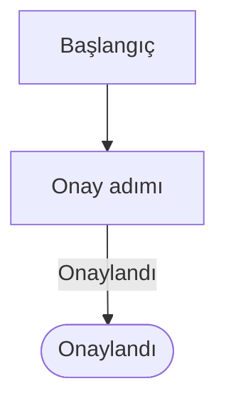
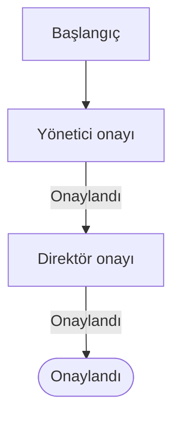
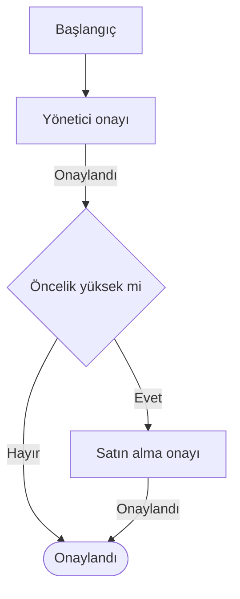
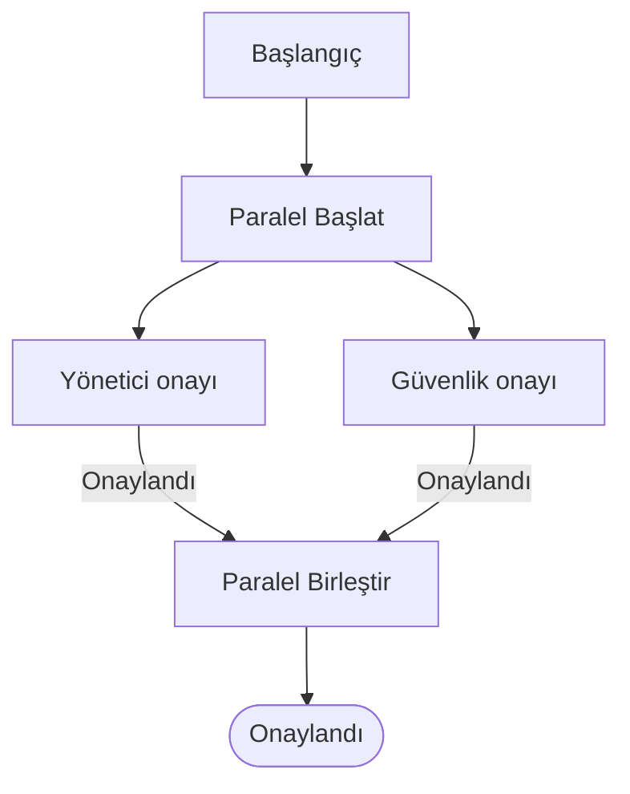
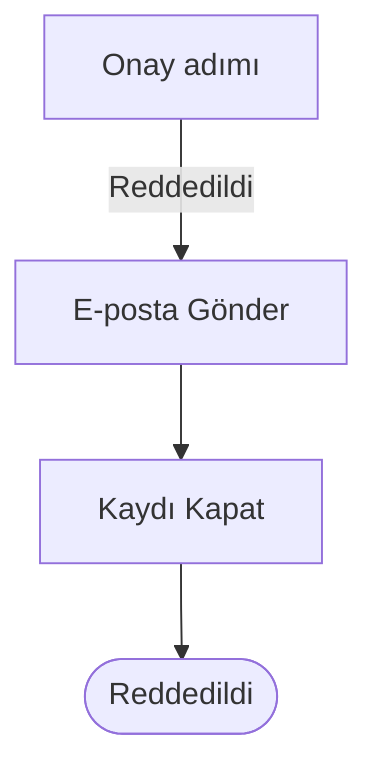

Bu sayfa gelişmiş onay akışını **uygulamalı** olarak anlatır. Düğümlerin,
onaycı kaynaklarının ve kuralların tam listesi için
[Gelişmiş Onay Akışı](/docs/teknisyen/moduller/katalog/gelismisonayakisi)
sayfasına bakın.

## Adım adım

<Callout type="info" title="ÖNEMLİ">
Akışı hem `Yönetim` ▸ `Gelişmiş Onay Akışları` ekranından hem de katalog
öğesinin içinden oluşturabilirsiniz. Aşağıdaki anlatım yönetim ekranından
başlar; böylece akış en baştan birden çok katalog öğesinde kullanılabilir olur.
</Callout>

1. `Yönetim` ▸ `Gelişmiş Onay Akışları` sayfasını açın ve `Akış Oluştur` deyin.
   Tuval boş açılır, yalnız `Başlangıç` düğümü durur.
2. Paletten `Onay` ▸ `Onay adımı ekle` ile bir onay adımı koyun. Hazır bir
   iskeletle başlamak isterseniz `Şablonla başla` düğmesini kullanın.
3. Eklediğiniz adıma tıklayın. Sağ panelden **onayı kimin vereceğini** seçin —
   örneğin `Yönetici zinciri` ve durma kuralı olarak *belirli kademe sayısı
   kadar*, 1 kademe.
4. Adımın altındaki `Onaylandı` çıkışını sürükleyerek bir sonraki düğüme
   bağlayın. Süreç burada bitiyorsa `Bitiş` ▸ `Onaylandı` düğümü ekleyip ona
   bağlayın.
5. Üst çubuktan akışa bir **ad** verin ve `Kaydet` deyin. Kaydetmeden önce
   `Doğrula` ile kontrol edebilirsiniz.
6. Katalog öğesini açın, `Detaylar` sekmesindeki onay bölümünden
   `Gelişmiş Onay Akışı` sekmesine geçin, oluşturduğunuz akışı seçin ve **öğeyi
   kaydedin**.

Artık o katalog öğesinden açılan her istek bu akışı çalıştırır.

<Callout type="warn" title="DİKKAT">
Altıncı adımı atlamayın. Akışı kaydetmek tek başına yetmez; akış bir katalog
öğesine bağlanmadığı sürece hiçbir istekte çalışmaz.
</Callout>

## Hazır tarifler

### Tek onay

En yaygın kalıp. Tek bir onay adımı ve arkasında bitiş düğümü. `Reddedildi`
çıkışını boş bırakabilirsiniz — istek reddedilmiş olarak kapanır.

### İki kademeli onay

İlk adımın `Onaylandı` çıkışını ikinci onay adımına bağlayın.

<Callout type="info" title="ÖNEMLİ">
Kademeli yönetici onayı istiyorsanız iki ayrı adım koymanıza gerek yok: tek bir
adımda `Yönetici zinciri` seçip durma kuralını *2 kademe* yapmak aynı sonucu
verir ve şemayı sade tutar.
</Callout>

### Koşullu onay

Belirli durumlarda ek bir onay isteyin. Koşul düğümünün **iki dalı da**
bağlanmak zorundadır.

### Paralel onay

Birbirini beklemesi gerekmeyen onaylar için. İki dal da aynı birleştirme
düğümünde buluşmalıdır.

<Callout type="warn" title="DİKKAT">
Paralel daldaki onay adımlarında **Revize ayarını kapatın**. Açık kalırsa onaycı
revize dediğinde kardeş dalın onayı hâlâ beklerken tüm talep revize beklemeye
geçer.
</Callout>

### Reddedilince bilgilendirme ve kapatma

Reddedilen talepte kullanıcıya bilgi verip kaydı kapatmak için.

<Callout type="error" title="KRİTİK">
Bu kalıpta yolun sonundaki `Bitiş: Reddedildi` düğümü **zorunludur**. Koymazsanız
reddedilen talep onaylanmış olarak kapanır.
</Callout>

## Sık yapılan hatalar

| Hata | Sonucu |
|---|---|
| Red yolunu aksiyonla uzatıp bitiş düğümü koymamak | Reddedilen talep **onaylanmış** kapanır |
| Paralel dal adımlarında `Revize` ayarını açık bırakmak | Onaycı revize dediğinde tüm talep beklemeye geçer, diğer dal da durur |
| Akışı kaydedip katalog öğesine bağlamayı unutmak | Akış hiçbir istekte çalışmaz |
| Akışı kaydetmeden katalog öğesini kaydetmeye çalışmak | Sistem uyarır, öğe kaydedilmez |
| Aynı akışı birden çok öğe kullanırken yönetim ekranından değiştirmek | Değişiklik **tüm** öğelere yansır |
| Kritik adımda **Onaycı yoksa adımı atla** ayarını açık bırakmak | Eksik yönetici tanımı sessizce onaya dönüşür |
| Kullanılan bir akışı arşivlemeye çalışmak | Sistem izin vermez; önce öğelerin bağını kaldırın |

## Test edin

Akışı yayına almadan önce bir test kullanıcısıyla o katalog öğesinden istek
açın ve onayın doğru kişiye gittiğini görün. İstek detayındaki onay bölümünde
akışın hangi adımda beklediğini adım adım izleyebilirsiniz.
