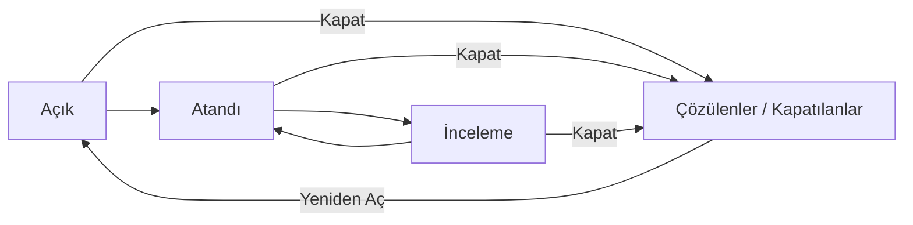

Her problemin bir durumu vardır ve her durum bir **aşamaya** aittir. Aşama, problemin listede görünüp görünmeyeceğini ve hangi işlemlerin yapılabileceğini belirler.

## Durumlar

| Durum | Ne zaman kullanılır |
|---|---|
| `Açık` | **Açık aşama.** Yeni açılan problemin varsayılan durumu. |
| `Atandı` | **Açık aşama.** Problem bir teknisyene atanmış, üzerinde çalışılıyor. |
| `İnceleme` | **Açık aşama.** Kök neden araştırılıyor ya da çözüm değerlendiriliyor. |
| **Çözülenler** | **Kapalı aşama.** Problem çözüldü. |
| **Kapatılanlar** | **Kapalı aşama.** Problem kapatıldı (çözüme ihtiyaç kalmaması, bilinen hata olarak bırakılması gibi). |

Durum listesi yöneticiler tarafından genişletilebilir; kurumunuzda farklı durumlar görebilirsiniz.

Açık aşamadaki durumlar arasında serbestçe geçebilirsiniz; bunun için `Özellikler` panelindeki `Durum` alanını ya da kartın `Hızlı Güncelleme` simgesini kullanın. Kapalı bir duruma ise yalnızca **kapatma**, **silme** ya da **birleştirme** ile geçilir; kapalı bir problemi tekrar açık aşamaya almak için **yeniden açma** kullanılır.

Liste açılışta yalnızca açık aşamadaki problemleri gösterir. Kapalı problemleri görmek için `Kontrol Paneli`nde `Aşama` alanından `Kapalı`yı seçin.

## Problemi kapatma

Problemin araç çubuğundaki `Kapat` düğmesi `Kapatma Bilgileri` penceresini açar.

| # | Alan | Açıklama |
|---|---|---|
| ❶ | `Gerekçe` | Problemin neden kapatıldığı (aşağıdaki liste). Tek bir problemi kapatırken isteğe bağlı, toplu kapatmada zorunludur. |
| ❷ | `Durum` | **Zorunlu.** Problemin alacağı kapalı durum: `Çözülenler` ya da `Kapatılanlar`. |
| ❸ | **Kapatma Açıklaması** | **Zorunlu.** Problemin nasıl sonuçlandığının kısa açıklaması. Sağ paneldeki `Kullanıcı / Bilgiler` bölümünde görünür. |

Kapatma gerekçeleri:

| Gerekçe | Ne zaman |
|---|---|
| `Bilinen Hata` | Neden biliniyor ama kalıcı çözüm şimdilik uygulanmayacak; problem bilinen hata olarak kayıtlarda kalıyor. |
| **Değişiklik Kaydı Açıldı** | Kalıcı çözüm bir değişiklik kaydına devredildi. |
| **Geçici Çözüm Bulundu** | Sorun geçici bir çözümle idare ediliyor. |
| **Kalıcı Çözüm Bulundu** | Kök neden ortadan kaldırıldı. |
| **Çözüme İhtiyaç Kalmadı** | Sorun kendiliğinden ortadan kalktı ya da etkilenen sistem kullanımdan çıktı. |

Birden fazla problemi birlikte kapatmak için listede seçip toplu işlem çubuğundaki `Kapat`ı kullanın; bkz. [Problem Listesi](/docs/teknisyen/moduller/problemler/liste#toplu-işlemler).

## Kapalı problem

Kapalı bir problemde `Kapat` düğmesinin yerinde `Yeniden Aç` ❶ görünür ve `Özellikler` alanları salt okunur olur. Sağ paneldeki `Kullanıcı / Bilgiler` bölümünde kapatılma tarihi ve kapatma açıklaması ❷ yer alır.

## Yeniden açma

`Yeniden Aç` düğmesi bir pencere açar. Problemin alacağı açık aşamadaki `Durum`u ❶ seçip `Yeniden Aç`a basın.

## Silme

Bir problemi silmek için araç çubuğundaki `Diğer Eylemler` › `Sil`i ya da listedeki toplu `Sil`i kullanın. Pencerede bir `Silme Gerekçesi` yazmanız ve kapalı bir `Durum` seçmeniz istenir. Silinen problemler listede görünmez; silinen kayıtları görme yetkisi olanlar `Kontrol Paneli`ndeki `Silinmiş mi?` kutusuyla onları listeleyebilir.

## Kapatma kuralları

Sistem yöneticiniz, bir problemin kapatılabilmesi için bazı koşulları zorunlu tutabilir. Kurallar varsayılan olarak kapalıdır. Açılabilecek kurallardan bazıları:

| Kural | Kapatmadan önce gereken |
|---|---|
| Teknisyen, teknisyen grubu, kategori | İlgili alan dolu olmalı. |
| Kök neden, analiz, belirtiler | `Analiz` sekmesindeki kartlar doldurulmuş olmalı. |
| Nihai çözüm | En az bir çözüm girilmiş olmalı. |
| Görevler | İlişkili görevler kapatılmış olmalı. |
| İş günlüğü, not | Problemde iş günlüğü ya da not bulunmalı. |
| Kapatma açıklaması | Kapatma açıklaması yazılmalı. |

Eksik bir kural varsa `Kapat` düğmesine bastığınızda pencere açılmaz; ekranın sağ altında eksik kuralları listeleyen bir uyarı çıkar. Formdaki zorunlu alanlar boşsa `Kapat` düğmesi kilitlenir ve üzerine geldiğinizde eksik alanlar listelenir.

## Bağlı olaylar ne olur

Varsayılan olarak bir problemi kapatmak ya da yeniden açmak bağlı olayların durumunu değiştirmez. Sistem yöneticiniz Genel Ayarlar'dan şu davranışları açabilir:

- Problem kapatıldığında bağlı olayları da kapatmak (kapatma gerekçesi ve açıklamasıyla birlikte) ve problemin çözümünü olaylara kopyalamak.
- Problemin durumu değiştiğinde bağlı olayların durumunu da değiştirmek.
- Problem yeniden açıldığında bağlı olayları da açmak.

Kurumunuzda bu ayarların açık olup olmadığını sistem yöneticinize sorun.
