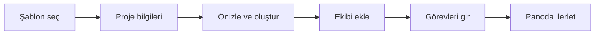

Bu sayfa, modülü ilk kez kullananlar için uçtan uca kısa bir turdur: bir proje açar,
ekibi ekler ve ilk görevi panoda ilerletirsiniz. Ayrıntılar için her adımda ilgili
sayfaya bağlantı verilmiştir.

## Yol

## 1. Projeyi açın

`Projeler` sayfasının sağ üstündeki `Proje Oluştur` düğmesi sihirbazı başlatır. Düğme
yalnızca **Proje Ekleyebilir** yetkisi olan kullanıcılara görünür.

Sihirbaz üç adımdır: `Şablon Seç`, `Proje Bilgileri`, `Önizleme`. **Şablon seçmeden
sonraki adıma geçilemez.**

Şablon projenin iskeletini belirler — görev türleri, durumlar ve **yapı türü** (Basic,
Scrum, Kanban) şablondan gelir. Kutudan çıkan sistem şablonları:

| Şablon | Yapı türü |
|---|---|
| Yazılım Projesi (Scrum) | Scrum |
| Yazılım Projesi (Kanban) | Kanban |
| Yazılım Projesi (Waterfall) | Basic |
| Hukuk Projesi | Kanban |
| Finans Projesi | Basic |
| İnsan Kaynakları Projesi | Kanban |
| Pazarlama Projesi | Kanban |
| BT Operasyon Projesi | Kanban |
| İnşaat Projesi | Basic |
| Eğitim Projesi | Kanban |
| Danışmanlık Projesi | Basic |

Sistem şablonları arasında sprint kullanan tek şablon **Yazılım Projesi (Scrum)**'dur.

<Callout type="info" title="ÖNEMLİ">
Yapı türü sonradan `Ayarlar` ▸ `Genel` bölümünden **değiştirilebilir** ve bu işlem veri
silmez — yalnızca hangi ekranların (iş listesi, sprint, pano) görüneceğini belirler.

Yine de doğru şablonla başlamak en temizidir: Scrum'dan Basic'e geçtiğinizde sprintler ve
hikaye puanları arayüzden kaybolur (veri durur ama görünmez). Bkz.
[Kavramlar ve Hiyerarşi](/docs/teknisyen/moduller/projeler/kavramlar).
</Callout>

İkinci adımda yalnızca **Proje Adı** zorunludur. Açıklama, proje türü, öncelik, proje
lideri, risk seviyesi ve zaman çizelgesi isteğe bağlıdır.

<Callout type="info" title="ÖNEMLİ">
`Proje Lideri` yalnızca bir görünüm alanı değildir: proje lideri, proje içindeki tüm
sekmeleri yetki kontrolüne takılmadan görür. Bu yüzden lideri gerçek sorumluya göre seçin.
</Callout>

Üçüncü adım, şablonun projeye ne kuracağını özetler. Onayladığınızda proje oluşturulur ve
şablondaki yapılandırma projeye **kopyalanır**: görev türleri, durumlar ve aralarındaki
geçişler, pano ve pano kolonları, özel alan eşlemeleri, bildirim ayarları ve proje
rolleri.

<Callout type="info" title="ÖNEMLİ">
Kopyalanır, bağlanmaz. Şablonu sonradan değiştirmeniz, o şablonla daha önce açılmış
projeleri etkilemez; bir projedeki durum değişikliği de şablona veya diğer projelere
yansımaz.
</Callout>

## 2. Ekibi ekleyin

`Ayarlar` ▸ `Üyeler` sekmesinden proje ekibini ekleyin ve her üyeye proje rolünü verin.

Bu adım atlanabilir görünse de modülün yetki modelinin özüdür: bir kullanıcının proje
içinde **ne yapabileceğine** proje rolü karar verir. Modüle girebilmesi için gereken
global yetki ise yalnızca **Projeleri Görebilir**'dir.

## 3. İlk görevleri girin

Görevler üç yerden açılabilir:

- **Pano** — kolon başındaki ekleme alanından hızlı görev
- **Görevler** — ızgara üzerinden, tüm alanlarıyla
- **İş Listesi** — yalnız Scrum projelerinde, sprint planlamasıyla birlikte

Görev türü (epik, hikaye, görev, hata…) ve durum, projenin kendi kataloğundan seçilir.

## 4. Panoda ilerletin

`Pano` sekmesinde görev kartını kolondan kolona sürükleyerek durumunu değiştirirsiniz.

<Callout type="warn" title="DİKKAT">
Projede **geçiş kuralları** tanımlıysa her sürükleme serbest değildir: bir statüden
diğerine geçiş yalnızca tanımlı bir geçiş varsa mümkündür ve geçişe form, koşul veya
onay kapısı bağlanmış olabilir. Kart eski yerine geri dönüyorsa sebebi genellikle budur.
</Callout>

## Sonraki adımlar

<Cards>
  <Card title="Kavramlar ve Hiyerarşi" href="/docs/teknisyen/moduller/projeler/kavramlar">
    Yapı türlerinin hangi özellikleri açıp kapattığı ve sekmelerin tam listesi.
  </Card>
</Cards>
