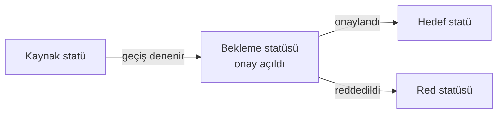

Bir durum geçişine **onay** bağlandığında, görev doğrudan hedef duruma geçmez: önce bir
**onay isteği** açılır ve görev onay sonuçlanana kadar bir bekleme statüsünde durur.

## Akışın yapısı

Onay `Ayarlar` ▸ `Geçişler` bölümünde ilgili geçişe bağlanır — bkz.
[Geçişler](/docs/teknisyen/moduller/projeler/yapilandirma/gecisler).

## Üç statü gerekir

<Callout type="warn" title="DİKKAT">
Onaylı bir geçiş **üç statü ve üç kenar** ister:

- `Kaynak → Bekleme` (istek açılır)
- `Bekleme → Hedef` (onaylandı)
- `Bekleme → Red` (reddedildi)

Bu kenarlardan biri eksikse görev **takılı kalır**: onay verilir ama görev kıpırdamaz,
ekranda da hata görünmez. Onay yapılandırdıktan sonra geçiş grafiğini
`İş Akışı Diyagramı` bölümünden gözle doğrulamak en hızlı kontroldür.
</Callout>

<Callout type="info" title="ÖNEMLİ">
Bekleme ve red kenarlarına **koşul veya doğrulayıcı koymayın**. Onay sonucu uygulanırken
bu kenarlar yeniden değerlendirilir ve konulan bir koşul akışı kilitleyebilir.

Kullanıcıların onay kapısını elle atlamasını engellemek istiyorsanız, o kenara da **aynı
onay yapılandırmasını** verin — böylece manuel deneme "onay gerekiyor" ile geri çevrilir.
</Callout>

## Onaycıyı kim görür

Onay bekleyen istekler onaycının `Benim İşlerim` ▸ `Onaylarım` sekmesinde listelenir.
E-posta ile gönderilen onay bağlantısı üzerinden oturum açmadan da onay verilebilir.

## Çok kapılı akışlar

Bir görev birden fazla onaydan geçebilir (örneğin müdür → yönetici → iş birimi). Her kapı
kendi bekleme statüsünü ve kenarlarını gerektirir.

<Callout type="warn" title="DİKKAT">
Bir görevde **aynı anda yalnız bir açık onay isteği** olabilir. Önceki istek
kapanmadan sonraki kapı açılamaz; bu yüzden çok kapılı akışlarda her aşamanın temiz
kapandığından emin olun.
</Callout>

## Vekalet

Bir onaycı yerine geçici olarak başkası onay verebilir (izin, tatil). Vekalet tanımlıysa
onay isteği **doğrudan vekile** düşer.

<Callout type="warn" title="DİKKAT">
Vekalet, istek **oluşturulurken** uygulanır ve ekranda görünür bir ipucu bırakmaz:
geçiş ayarlarında onaycı olarak bir kişi yazarken istek başkasına düşebilir.

"Onay yanlış kişide" şikâyetinde ilk bakılacak yer aktif vekalet tanımlarıdır. Ayrıca
vekalet **açık isteklere geriye dönük uygulanmaz**; bekleyen isteği iptal edip yeniden
açtırmak gerekir.
</Callout>

## İlgili sayfalar

<Cards>
  <Card title="Geçişler" href="/docs/teknisyen/moduller/projeler/yapilandirma/gecisler">
    Onayın bağlandığı geçiş kuralları.
  </Card>
  <Card title="Benim İşlerim" href="/docs/teknisyen/moduller/projeler/ileri/benim-islerim">
    `Onaylarım` sekmesi.
  </Card>
</Cards>
