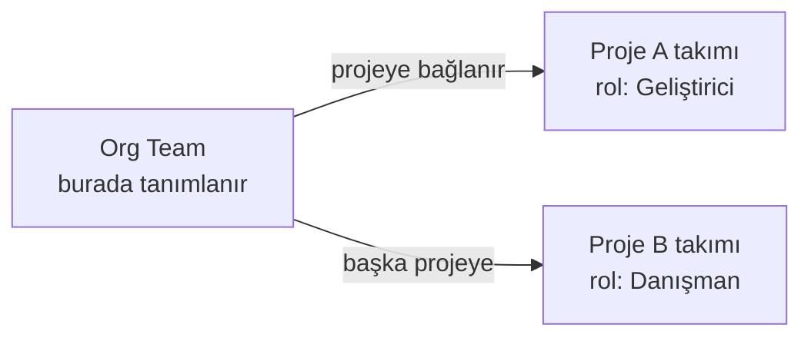

Kenar çubuğundaki `Takımlar` ve `Kapasite` sayfaları, proje ayarlarındaki aynı adlı
bölümlerin **organizasyon seviyesindeki** karşılığıdır.

<Callout type="warn" title="DİKKAT">
Her iki sayfa da **Programları Görebilir** yetkisi ister. Yalnız proje yetkisi olan bir
kullanıcı bunları kenar çubuğunda görmez.
</Callout>

## Takımlar — organizasyon havuzu

| # | Bölüm | Ne işe yarar |
|---|---|---|
| ❶ | Başlık ve kayıt sayısı | Havuzdaki toplam takım |
| ❷ | Araç çubuğu | Arama, yenileme ve `Yeni Takım` |
| ❸ | Liste | Kod, ad, açıklama, oluşturulma tarihi ve `Üyeler` düğmesi |

<Callout type="info" title="ÖNEMLİ">
Görselde liste, ekranın üstündeki arama kutusuyla daraltılmıştır; süzgeç
temizlendiğinde tüm kayıtlar listelenir.
</Callout>

Bu sayfa **org Team** kayıtlarını yönetir: kurumdaki takım kimlikleri burada tanımlanır
ve projelere buradan bağlanır.

Aynı org takım birden fazla projede, **farklı rollerle** çalışabilir. Proje tarafındaki
bağlama işlemi için bkz.
[Takımlar](/docs/teknisyen/moduller/projeler/yapilandirma/takimlar).

<Callout type="info" title="ÖNEMLİ">
Proje takımları ile ITSM tarafındaki **ajan grupları** ayrı kavramlardır. Görev ataması
proje takımını kullanır; olay ve talep yönlendirmesi ajan grubunu. Aynı kişiler her
ikisinde bulunabilir ama listeler birbirine bağlı değildir.
</Callout>

## Kapasite — arz ve talep

| # | Bölüm | Ne işe yarar |
|---|---|---|
| ❶ | Sekmeler | İzinler, Müsaitlik, Kapasite Rollup, Takım, Organizasyon |
| ❷ | Kapasite ızgarası | Kişi başına haftalık boşta saat; dönem yukarıdan seçilir |

Kapasite sayfası iki tarafı karşılaştırır:

| Kavram | Ne demek |
|---|---|
| **Arz (kapasite)** | Takımların çalışabileceği toplam süre |
| **Talep** | Planlanmış işlerin gerektirdiği süre |
| **Doluluk** | Talebin arza oranı |

Proje seviyesindeki kapasite tanımları (üye başına haftalık saat) bu sayfanın **girdisidir**
— bkz. [Kapasite](/docs/teknisyen/moduller/projeler/yapilandirma/kapasite).

<Callout type="warn" title="DİKKAT">
Kapasite hesapları **tarihli ve tahminli** işlere dayanır:

- Tarihi olmayan iş, zaman eksenine yerleştirilemediği için talebe girmez.
- Tahmini (efor/story point) olmayan iş, süre üretemediği için yine talebe girmez.

Bu yüzden doluluk oranı gerçekte olduğundan **düşük** görünebilir. `Kapsam` sayfasındaki
`tarihsiz görev` ve `tahminsiz görev` uyarıları doğrudan bu ekranın doğruluğunu belirler —
bkz. [Kapsam](/docs/teknisyen/moduller/projeler/portfoy-program/kapsam).
</Callout>

## İzinler

Kapasite hesabına izinler de girer: izinli bir kişinin o haftaki kapasitesi düşer.
İzin tanımları organizasyon tarafında yönetilir.

## İlgili sayfalar

<Cards>
  <Card title="Kapasite (proje)" href="/docs/teknisyen/moduller/projeler/yapilandirma/kapasite">
    Üye başına haftalık kapasite tanımı.
  </Card>
  <Card title="Kapsam" href="/docs/teknisyen/moduller/projeler/portfoy-program/kapsam">
    Tarihsiz ve tahminsiz iş uyarıları.
  </Card>
</Cards>
