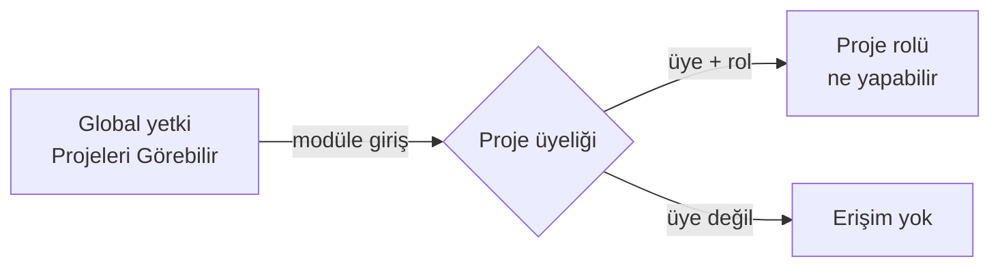

Proje modülünde erişim **iki bağımsız katmandan** geçer. Yetki sorunlarının neredeyse
tamamı bu ikisinin karıştırılmasından doğar.

## İki katman

| Katman | Neye karar verir | Nerede tanımlanır |
|---|---|---|
| **Global yetki** | Modüle **girip giremeyeceğinize** | Yönetici ▸ Roller |
| **Proje rolü** | Proje içinde **ne yapabileceğinize** | Proje ▸ Ayarlar ▸ Yetkiler |

<Callout type="info" title="ÖNEMLİ">
Proje içi işler için gereken global yetki **yalnızca `Projeleri Görebilir`**'dir.
Görev düzenlemek, iş günlüğü girmek, panoyu kullanmak için kullanıcıya `Proje Ekleyebilir`
gibi yaşam döngüsü yetkileri vermeye **gerek yoktur** — bunlar yalnızca projenin kendisini
açma, silme ve arşivleme içindir.
</Callout>

## Üst seviye sayfalar ayrı yetki ister

Modülün üst seviye sayfaları kendi global yetkilerine bağlıdır:

| Sayfa | Yetki |
|---|---|
| Projeler, Benim İşlerim | Projeleri Görebilir |
| Portföyler, Kapsam, Hedefler | Portföyleri Görebilir |
| Programlar, Bağımlılıklar, Takımlar | Programları Görebilir |
| Girişimler | Girişim yetkisi |

<Callout type="warn" title="DİKKAT">
Yalnız proje yetkisi verilmiş bir kullanıcı, kenar çubuğunda portföy ve program
sayfalarını **hiç görmez**. Bu bir hata değil, tasarım gereğidir: menüde görünüp
tıklandığında yetkisiz uyarısı vermek yerine, öğe hiç gösterilmez.
</Callout>

## Proje lideri

`Ayarlar` ▸ `Genel` bölümündeki **proje lideri**, rollerden bağımsız üçüncü bir kavramdır:
lider, proje içindeki tüm sekmeleri yetki kontrolüne takılmadan görür.

<Callout type="warn" title="DİKKAT">
Bu yüzden lideri "geçici olarak" birine vermek, ona projenin tamamını açmak demektir.
Test amacıyla yapılan bu değişikliklerin geri alınması unutulur.
</Callout>

## Sık karşılaşılan üç durum

### Ekran açılıyor ama veri gelmiyor

Genellikle **okuma ucunun yönetim yetkisine** bağlanmasından kaynaklanır: kullanıcı sayfayı
görür, kolonlar çizilir, ama içerik boş gelir ve hata mesajı çıkmaz. Rol tanımında
görüntüleme yetkilerinin verildiğinden emin olun.

### Menüde görünen sayfa yetkisiz diyor

Menü öğesinin yetkisi ile sayfanın gerçek yetkisi farklıysa olur. Doğru davranış, ikisinin
**aynı** olmasıdır.

### Üye eklenemiyor

Projede hiç **proje rolü** tanımlı değildir; `Üye Ekle` penceresindeki `Rol` listesi boş
kalır. Önce rol oluşturun — bkz.
[Yetkiler](/docs/teknisyen/moduller/projeler/yapilandirma/yetkiler).

## İlgili sayfalar

<Cards>
  <Card title="Yetkiler (Proje Rolleri)" href="/docs/teknisyen/moduller/projeler/yapilandirma/yetkiler">
    Rollerin ve yetkilerin tanımlandığı bölüm.
  </Card>
  <Card title="Üyeler" href="/docs/teknisyen/moduller/projeler/yapilandirma/uyeler">
    Rollerin kişilere atanması.
  </Card>
</Cards>
