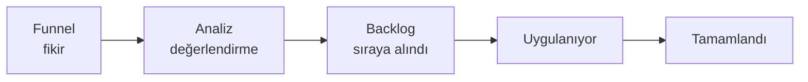

**Girişim**, program altında **değer bazlı** bir iş kalemidir: "ne yapacağız" değil, "hangi
değeri üreteceğiz" sorusunu tanımlar. Projeler işi yürütür, girişimler değeri ölçer.

## Değer akışı durumları

Girişimler bir huniden geçer; üstteki sekmeler bu aşamaları ve her birindeki adedi
gösterir:

| Durum | Anlamı |
|---|---|
| **Funnel** | Fikir aşamasında, henüz değerlendirilmedi |
| **Analiz** | Fayda ve maliyet inceleniyor |
| **Backlog** | Onaylandı, sıraya alındı |
| **Uygulanıyor** | Üzerinde çalışılıyor |
| **Tamamlandı** | Bitti |

## Kolonlar

| Kolon | İçerik |
|---|---|
| **Kod** | Girişim kodu (`INI-5`) |
| **Ad** | Ad ve açıklama |
| **Durum** | Değer akışındaki aşama |
| **Sağlık** | `Yolunda`, `Risk Altında`, `Engellendi` |
| **Fayda** | 100 üzerinden fayda puanı, çubukla birlikte |
| **WSJF** | Önceliklendirme skoru |
| **Sahip** | Sorumlu kişi |
| **Hedef Tarih** | Beklenen tamamlanma |

## Fayda puanı ve WSJF

İki farklı önceliklendirme ölçüsü yan yana durur:

- **Fayda puanı** — girişimin üreteceği değerin 100 üzerinden tahmini.
- **WSJF** (*Weighted Shortest Job First*) — değeri **işin süresine bölen** bir skor; aynı
  faydayı daha kısa sürede veren iş öne çıkar.

<Callout type="info" title="ÖNEMLİ">
İkisi farklı sorular yanıtlar: fayda puanı "**ne kadar değerli**", WSJF "**şimdi hangisini
yapmalıyız**". Yüksek faydalı ama çok uzun bir girişim, düşük WSJF alarak sıranın
gerisine düşebilir — bu beklenen davranıştır.
</Callout>

## Epic bağlama

Girişimler doğrudan görev içermez; projelerdeki **epic'lere** bağlanır. Girişimin yol
haritası, kendisine bağlanan epic'lerin tarihlerinden çizilir.

<Callout type="warn" title="DİKKAT">
Bir girişime hiç epic bağlanmamışsa yol haritasında **çubuk çıkmaz** — girişim listede
görünür ama zaman ekseninde yer almaz. Aynı şekilde bağlı epic'in **tarihi yoksa** o da
çizilemez.
</Callout>

## Görünümler

Sağ üstteki simgeler liste, kart ve pano görünümleri arasında geçiş yapar. Pano
görünümü girişimleri değer akışı durumlarına göre sütunlara ayırır — huninin bütününü
görmek için en pratik görünümdür.

## İlgili sayfalar

<Cards>
  <Card title="Programlar" href="/docs/teknisyen/moduller/projeler/portfoy-program/programlar">
    Girişimlerin bağlandığı üst katman.
  </Card>
  <Card title="Kavramlar ve Hiyerarşi" href="/docs/teknisyen/moduller/projeler/kavramlar">
    Girişim–proje–epic ilişkisi.
  </Card>
</Cards>
