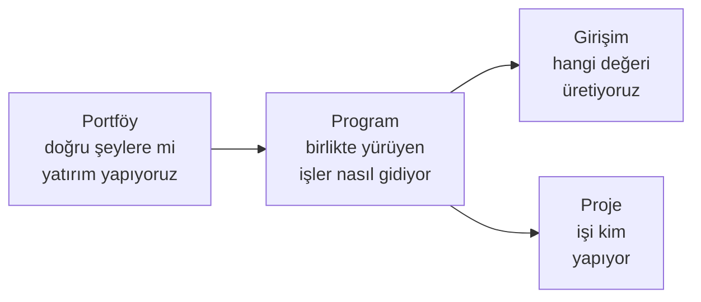

Proje seviyesinin üstünde üç katman bulunur. Her biri farklı bir soruyu yanıtlar:

<Callout type="warn" title="DİKKAT">
Bu üç sayfanın her biri **ayrı yetki** ister: `Portföyleri Görebilir`,
`Programları Görebilir` ve `Girişimleri Yönetebilir`. Yalnız proje yetkisi verilmiş bir
kullanıcı bu sayfaları kenar çubuğunda hiç görmez — bu beklenen davranıştır.
</Callout>

<Cards>
  <Card title="Portföyler" href="/docs/teknisyen/moduller/projeler/portfoy-program/portfoyler">
    Program sayaçları, kapasite/talep karşılaştırması, finansallar.
  </Card>
  <Card title="Programlar" href="/docs/teknisyen/moduller/projeler/portfoy-program/programlar">
    Girişim ve proje sayaçları, Program Increment'ler, sağlık göstergesi.
  </Card>
  <Card title="Girişimler" href="/docs/teknisyen/moduller/projeler/portfoy-program/girisimler">
    Değer akışı durumları, fayda puanı ve WSJF, epic bağlama.
  </Card>
</Cards>
