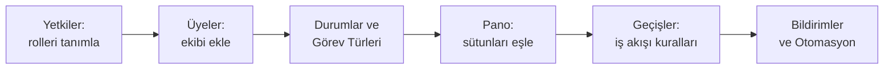

Proje ayarları, projenin `Ayarlar` sekmesinden açılır. Sol tarafta **14 bölüm** bulunur;
her biri projenin ayrı bir yönünü yapılandırır.

<Callout type="info" title="ÖNEMLİ">
Ayarların tamamı **projeye özeldir**. Bir projede yaptığınız değişiklik diğer projeleri
etkilemez; ayarların ilk hâli proje oluşturulurken **şablondan kopyalanır** — bkz.
[Proje Oluşturma](/docs/teknisyen/moduller/projeler/proje-olusturma).
</Callout>

## Bölümler

| Bölüm | Ne yapılandırır |
|---|---|
| **Genel** | Proje adı, açıklaması, lideri, tarihleri, sağlık ve risk seviyesi |
| **Pano** | Pano sütunları, sütun–durum eşlemesi, WIP limitleri |
| **Durumlar** | Projenin görev durumları ve durum kategorileri |
| **Görev Türleri** | Epik, hikaye, görev, hata gibi türler; renk ve simgeleri |
| **Çözümler** | Görev kapanış nedenleri |
| **Etiketler** | Projede kullanılabilecek etiketler |
| **Üyeler** | Projede kim var ve hangi rolde |
| **Takımlar** | Proje takımları ve üyeleri |
| **Kapasite** | Haftalık kapasite ve izinler |
| **Bildirimler** | Hangi olayda kime bildirim gideceği |
| **Yetkiler** | Proje rolleri ve rollerin yetkileri |
| **Geçişler** | Durumlar arası geçişler; koşul, ekran ve onay kapıları |
| **Alanlar** | Görev türlerine bağlı özel alanlar |
| **Otomasyon** | Tetikleyici–koşul–aksiyon kuralları |

## Önerilen sıra

Yeni bir projeyi yapılandırırken şu sıra işi kolaylaştırır:

<Callout type="warn" title="DİKKAT">
**Yetkiler (roller) her şeyden önce gelir.** Projeye üye eklerken bir rol seçmek
zorunludur; projede hiç rol tanımlı değilse `Üye Ekle` penceresindeki `Rol` listesi boş
kalır ve üye eklenemez.

Roller normalde şablondan kopyalanır, ancak **şablonda rol tanımlı değilse** proje
sıfır rolle açılır. Bu durumda önce `Yetkiler` bölümünden en az bir rol oluşturun.
</Callout>

## Bu bölümdeki sayfalar

<Cards>
  <Card title="Pano Ayarları" href="/docs/teknisyen/moduller/projeler/yapilandirma/pano-ayarlari">
    Sütun–durum eşlemesi, eşlemsiz durumlar, WIP limiti, hızlı filtreler.
  </Card>
  <Card title="Durumlar" href="/docs/teknisyen/moduller/projeler/yapilandirma/durumlar">
    Görev durumları, kategoriler, sıra numarası ve çift durum kümesi tuzağı.
  </Card>
  <Card title="Görev Türleri" href="/docs/teknisyen/moduller/projeler/yapilandirma/gorev-turleri">
    Türler, anahtarlar, epik ve alt görev rozetleri, pasifleştirme.
  </Card>
  <Card title="Üyeler" href="/docs/teknisyen/moduller/projeler/yapilandirma/uyeler">
    Projeye üye ekleme, rol atama ve gözlemci (salt okunur) üyeler.
  </Card>
</Cards>

<Callout type="info" title="ÖNEMLİ">
Diğer bölümlerin ayrıntılı sayfaları aşamalı olarak eklenmektedir.
</Callout>
