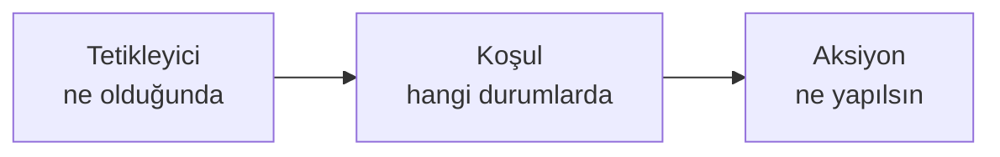

`Ayarlar` ▸ `Otomasyon`, projede tekrar eden işleri kurallara bağlar: bir olay olduğunda
(tetikleyici), belirli koşullar sağlanıyorsa, bir dizi işlem çalışır.

## Ekranın bölümleri

| # | Bölüm | Ne işe yarar |
|---|---|---|
| ❶ | Bölüm listesi | Ayarların 14 bölümü; rozetler o bölümdeki kayıt sayısını gösterir |
| ❷ | Bölüm içeriği | Seçili bölümün ayarları |
| ❸ | `Test` | Kuralı çalıştırmadan önce dener |

## Ekranın yapısı

| Öğe | Ne yapar |
|---|---|
| `Kural Oluştur` | Yeni kural tanımlar |
| `Test` | Kuralı gerçek kayıt üzerinde denemeden önce sınar |
| `Günlükler` | Kuralların çalışma kayıtları |
| Arama ve süzgeçler | Kuralı ada, duruma ve tetikleyici türüne göre bulur |

Başlıktaki sayı tanımlı kural adedini gösterir.

## Kural yapısı

Bir kural üç parçadan oluşur:

- **Tetikleyici** — görev oluşturuldu, durum değişti, yorum eklendi, tarih yaklaştı…
- **Koşul** — alan karşılaştırmaları (öncelik, atanan, görev türü, özel alan…)
- **Aksiyon** — alan yazma, atama, bildirim, webhook, iş akışı başlatma

## Yazılabilen alanların sınırı

<Callout type="warn" title="DİKKAT">
Kural **kaydedilebildiği hâlde hiçbir şey yapmayabilir**. Alan yazma aksiyonu yalnızca
sınırlı sayıda alanı destekler:

- Görev adı
- Açıklama / not
- Öncelik
- Durum
- Hikaye puanı
- Tahmini süre

Bu listede olmayan bir alanı yazmaya çalışan aksiyon **sessizce başarısız olur**: hata
mesajı çıkmaz, günlüğe hata düşmez, kural "çalıştı" görünür ama alan değişmez.

Koşul tarafı çok daha geniş bir alan kümesini **okuyabildiği** için bu uyumsuzluk kolayca
gözden kaçar: koşulda kullanabildiğiniz her alanı aksiyonda yazamazsınız.
</Callout>

## Test ve günlükler

Yeni bir kuralı yayına almadan önce `Test` ile deneyin; `Günlükler` ise kuralın gerçekten
çalışıp çalışmadığını gösterir. Bir kuralın beklendiği gibi davranmadığı şüphesinde ilk
bakılacak yer burasıdır.

<Callout type="warn" title="DİKKAT">
**Kendi tetikleyicisini yazan kurallardan kaçının.** "Durum değiştiğinde" tetiklenen bir
kural yine durumu değiştiriyorsa kural kendini yeniden tetikleyebilir. Sistem bu zincirleri
engelleyen bir koruma taşır, ancak kuralı en baştan bu tuzağa düşmeyecek şekilde
tasarlamak daha sağlıklıdır: tetikleyicinin baktığı alanı aksiyonda yazmayın.
</Callout>

## İlgili sayfalar

<Cards>
  <Card title="Geçişler" href="/docs/teknisyen/moduller/projeler/yapilandirma/gecisler">
    Durum değişikliğine bağlı kural, ekran ve onay kapıları.
  </Card>
  <Card title="Yapılandırma" href="/docs/teknisyen/moduller/projeler/yapilandirma">
    Tüm ayar bölümleri ve önerilen sıra.
  </Card>
</Cards>
