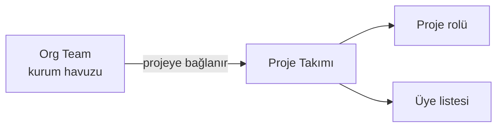

`Ayarlar` ▸ `Takımlar`, projede çalışan takımları tanımlar. Görevler kişilere olduğu gibi
**takımlara** da atanabilir.

## Ekranın bölümleri

| # | Bölüm | Ne işe yarar |
|---|---|---|
| ❶ | Bölüm listesi | Ayarların 14 bölümü; rozetler o bölümdeki kayıt sayısını gösterir |
| ❷ | Bölüm içeriği | Seçili bölümün ayarları |
| ❸ | `Takım Ekle` | Organizasyon takımını projeye bağlar |
| ❹ | Takım tablosu | Takım adı, rolü ve üye sayısı |

## Takım iki katmanlıdır

Takım kavramı iki seviyede yaşar:

- **Org Team** — kurum genelindeki takım kimliği; birden fazla projede kullanılabilir.
- **Proje Takımı** — org takımın o projeye bağlanmış hâli; projeye özgü rolü ve üye
  listesini taşır.

Bu yüzden `Takım Oluştur` penceresi iki seçenek sunar:

| Seçenek | Ne zaman |
|---|---|
| **Org havuzdan seç** | Takım kurumda zaten tanımlıysa; projeye bağlarsınız |
| **Yeni org Team oluştur** | Takım ilk kez tanımlanıyorsa; hem kurumda hem projede oluşturulur |

<Callout type="info" title="ÖNEMLİ">
Aynı org takımı birden fazla projede kullanabilirsiniz; her projede **farklı rolü** ve
farklı üye kümesi olabilir. Bu, "Mobil Geliştirme" ekibinin bir projede geliştirici,
diğerinde danışman rolünde çalışmasına izin verir.
</Callout>

## Liste

| Kolon | İçerik |
|---|---|
| **Takım** | Takım adı ve açıklaması |
| **Üyeler** | Takımdaki kişi sayısı |
| **Rol** | Takımın projedeki rolü |
| **Oluşturuldu** | Eklenme zamanı |
| **Düzenleme** | Üye yönetimi ve takımı projeden çıkarma |

Satır başındaki `+` takımı genişleterek üyelerini gösterir.

<Callout type="warn" title="DİKKAT">
Takıma eklenen kişiler **projeye de üye olur**. Ekran görüntüsünde takım oluşturulduktan
sonra `Üyeler` sayacının arttığı görülür. Yani takım eklemek, dolaylı olarak proje
erişimi vermek demektir — takım üyelerini bilinçli seçin.
</Callout>

## Proje takımı, ITSM ajan grubu değildir

<Callout type="warn" title="DİKKAT">
Proje takımları ile ITSM tarafındaki **ajan grupları** ayrı kavramlardır ve birbirinin
yerine geçmez. Görev ataması proje takımını kullanır; olay/talep yönlendirmesi ajan
grubunu. Aynı kişiler her ikisinde de bulunabilir ama listeler birbirine bağlı değildir.
</Callout>

## İlgili sayfalar

<Cards>
  <Card title="Üyeler" href="/docs/teknisyen/moduller/projeler/yapilandirma/uyeler">
    Kişi bazlı üyelik ve roller.
  </Card>
  <Card title="Kapasite" href="/docs/teknisyen/moduller/projeler/yapilandirma/kapasite">
    Üye bazında haftalık kapasite.
  </Card>
</Cards>
